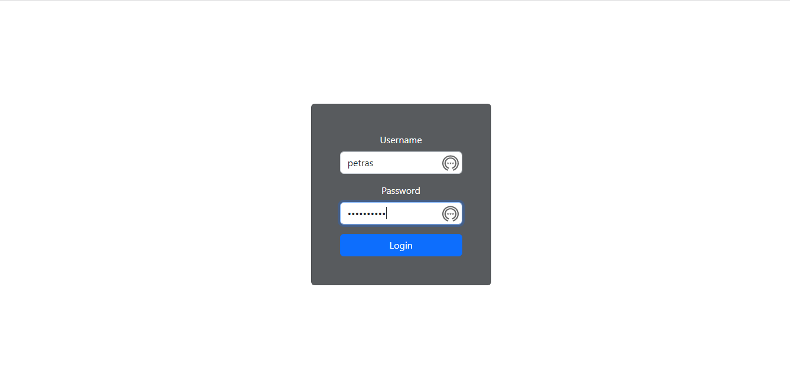
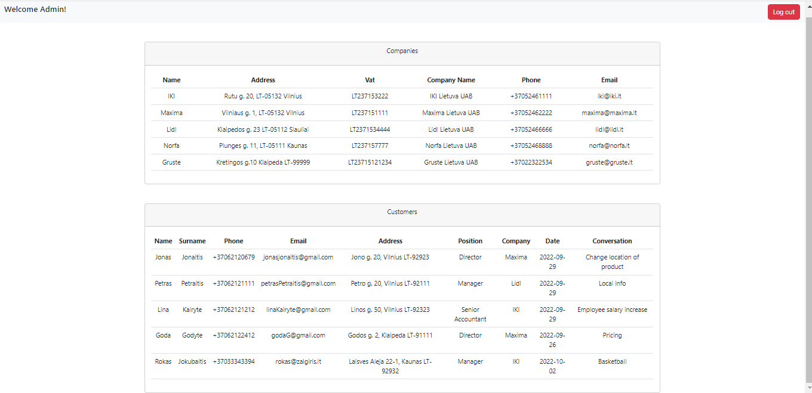
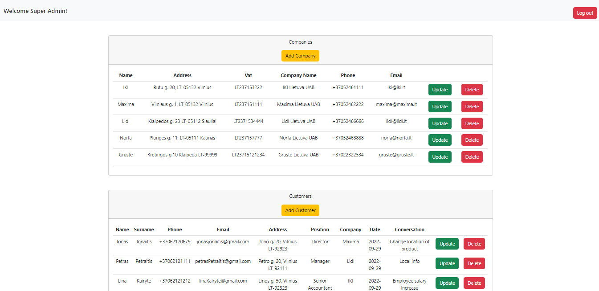
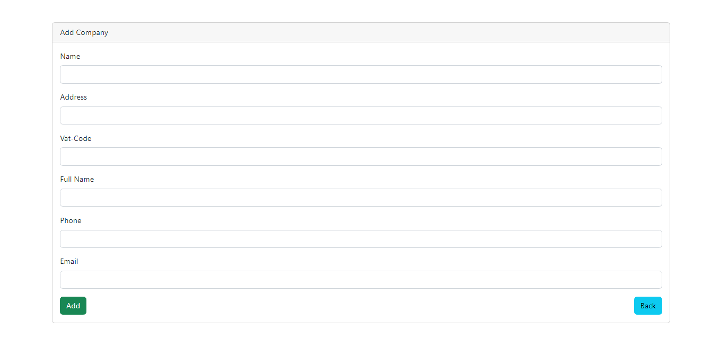
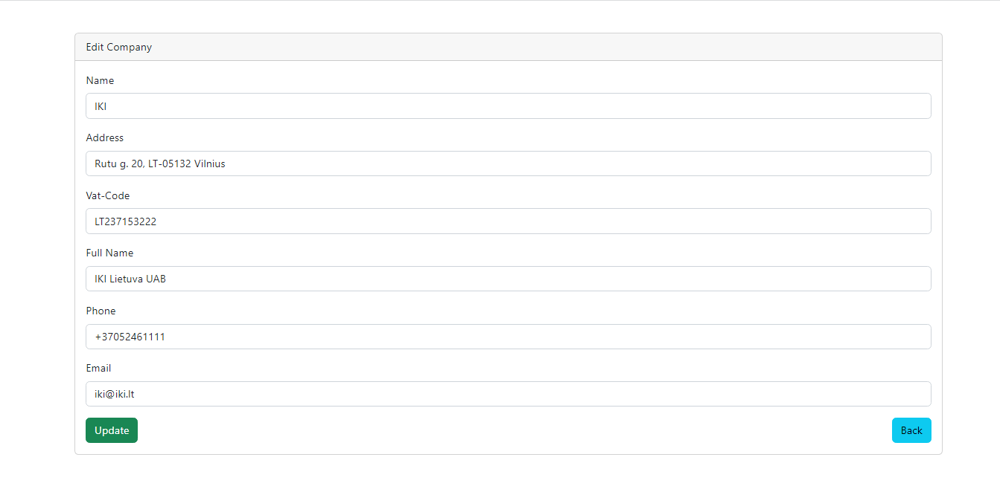
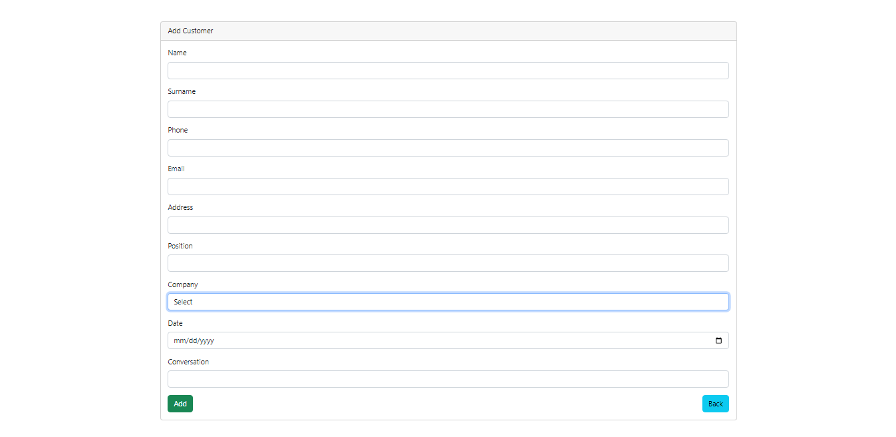
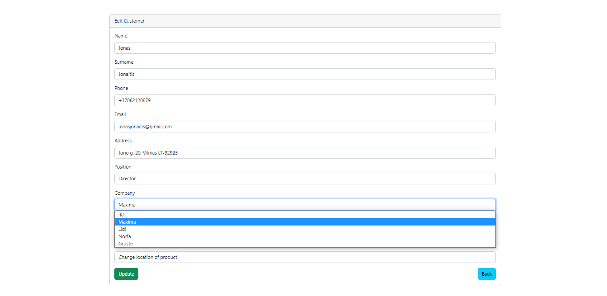

## Customer Relationship Manager

CRUD application for managing companies and employees/customers using PHP and Blade.

Simple login with user types being admin and superAdmin.

Admin logged in with possibility to only view the company and customer information without any other actions.

SuperAdmin logged in with access to CRUD actions.

Create a new company.

Update existing companies.

Create a new customer and add to applicable company. Add conversation and date.

Update customer information.

